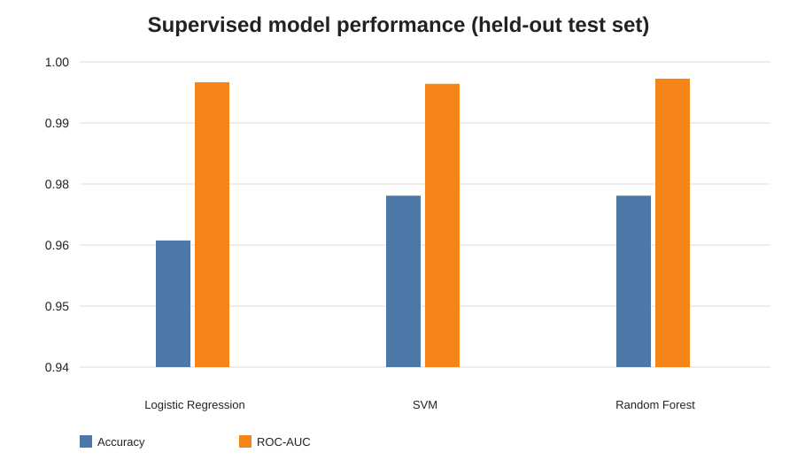
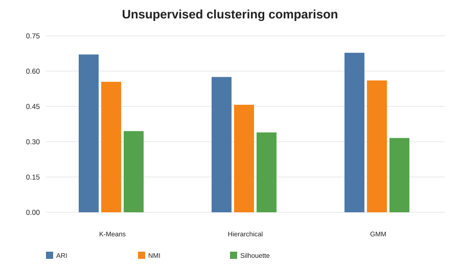
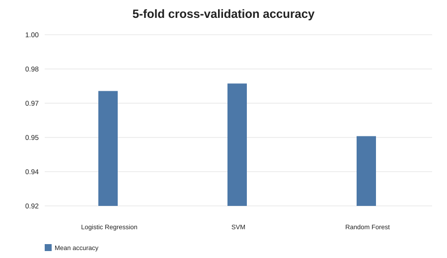
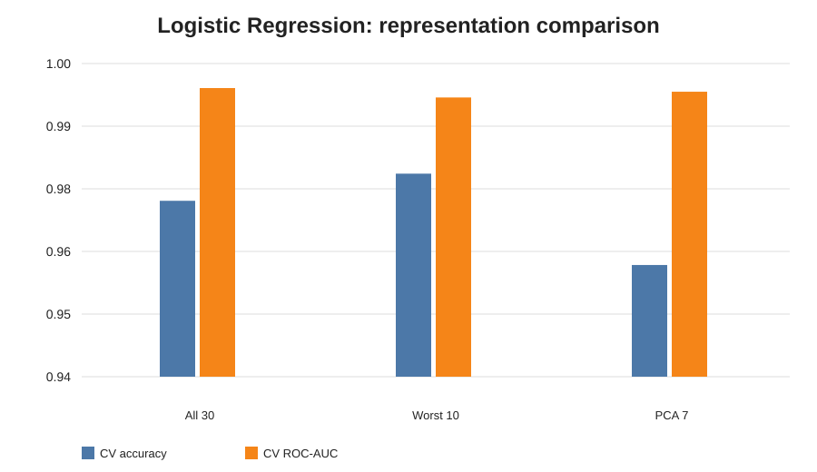

# Breast Cancer Morphology ML

[](https://github.com/nikitameena305/breast-cancer-morphology-ml/actions/workflows/verify.yml)

Reproducible supervised and unsupervised machine-learning analysis of breast-tumour morphology using the Wisconsin Diagnostic Breast Cancer dataset.

## Research question

**To what extent do supervised and unsupervised learning methods reveal consistent diagnostic structure in breast-tumour morphology, and can this structure be represented using a smaller subset of morphological features?**

## Dataset

- 569 observations
- 30 numerical morphology features
- 357 benign and 212 malignant samples
- mean, standard-error and worst-measurement feature families

The notebooks do not depend on a Colab-only upload. They look for a local CSV when available and otherwise reconstruct the equivalent dataset from `sklearn.datasets.load_breast_cancer`.

## Methods

- **Supervised:** Logistic Regression, SVM, Random Forest
- **Unsupervised:** K-Means, Hierarchical Clustering, Gaussian Mixture Model (GMM)
- **Feature analysis:** ANOVA F-scores and feature importance
- **Dimensionality reduction:** PCA
- **Robustness:** 5-fold stratified cross-validation

## Main findings

### Supervised test-set results

| Model | Accuracy | Sensitivity | Specificity | F1 | ROC-AUC |
|---|---:|---:|---:|---:|---:|
| Logistic Regression | 0.9649 | 0.9286 | 0.9861 | 0.9512 | 0.9960 |
| SVM | 0.9737 | 0.9286 | 1.0000 | 0.9630 | 0.9957 |
| Random Forest | 0.9737 | 0.9286 | 1.0000 | 0.9630 | 0.9967 |

### 5-fold cross-validation

| Model | Accuracy mean ± SD | ROC-AUC mean ± SD |
|---|---:|---:|
| Logistic Regression | 0.9737 ± 0.0166 | 0.9953 ± 0.0053 |
| SVM | 0.9772 ± 0.0163 | 0.9945 ± 0.0060 |
| Random Forest | 0.9526 ± 0.0131 | 0.9895 ± 0.0077 |

### Unsupervised clustering

| Method | ARI | NMI | Silhouette |
|---|---:|---:|---:|
| K-Means | 0.6707 | 0.5546 | 0.3450 |
| Hierarchical | 0.5750 | 0.4569 | 0.3394 |
| GMM | 0.6779 | 0.5603 | 0.3157 |

Clustering recovered meaningful but incomplete structure related to diagnosis. Cluster labels are not treated as diagnoses.

### Reduced representations

For Logistic Regression under 5-fold CV:

| Representation | Accuracy mean ± SD | ROC-AUC mean |
|---|---:|---:|
| All 30 features | 0.9737 ± 0.0166 | 0.9953 |
| Worst 10 features | 0.9789 ± 0.0119 | 0.9935 |
| PCA 7 components | 0.9614 ± 0.0153 | 0.9946 |

Seven principal components retain about 90% of total variance. Repeated feature analyses highlighted concave points, concavity, radius, perimeter, area and compactness, especially among mean and worst measurements.

## Repository structure

```text
breast-cancer-morphology-ml/
├── README.md
├── requirements.txt
├── .gitignore
├── data/
│   └── README.md
├── notebooks/
│   ├── 01_preprocessing.ipynb
│   ├── 02_logreg_kmeans.ipynb
│   ├── 03_svm_hierarchical.ipynb
│   ├── 04_rf_gmm.ipynb
│   ├── 05_final_comparison.ipynb
│   └── 06_feature_selection_pca.ipynb
├── figures/
│   ├── supervised_model_comparison.svg
│   ├── unsupervised_clustering_comparison.svg
│   ├── cross_validation_accuracy.svg
│   └── representation_comparison.svg
└── .github/workflows/
    └── verify.yml
```

## Reproduce from the repository

```bash
git clone https://github.com/nikitameena305/breast-cancer-morphology-ml.git
cd breast-cancer-morphology-ml
python -m venv .venv
```

Activate the environment:

**macOS/Linux**
```bash
source .venv/bin/activate
```

**Windows**
```powershell
.venv\Scripts\activate
```

Install dependencies:

```bash
python -m pip install --upgrade pip
pip install -r requirements.txt
```

Run the notebooks in numerical order from **01** to **06**, or use the automated GitHub Actions workflow. The workflow installs dependencies in a fresh Python environment and executes every notebook from the repository, so the project is checked independently of the original Colab session.

## Reproducibility design

- fixed random seeds where applicable;
- stratified train/test and cross-validation splits;
- scaling and PCA fitted on training data or inside CV pipelines;
- transformations re-fit independently within each fold to avoid leakage;
- supervised and unsupervised metrics interpreted separately.

## Figures









## Limitation

This is an academic machine-learning analysis, not a clinical diagnostic system. The dataset is relatively small and the reported cross-validation is internal validation only. No independent external clinical cohort was used.

## Author

**Nikita Meena**  
M2 Artificial Intelligence and Data Analysis, Sorbonne University
